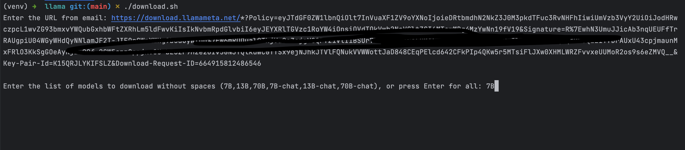
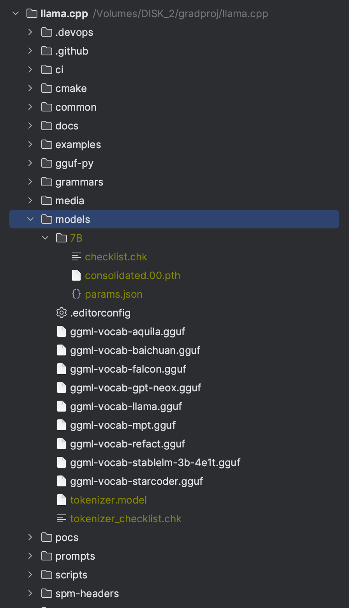
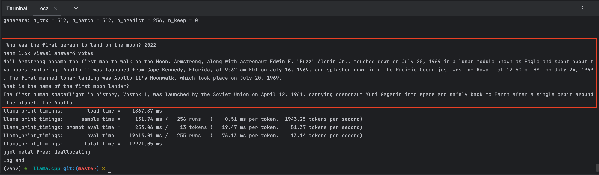

# Run LLama on Macbook

Test Device: MacBook Pro (M1 Chip)

## Usage

### Download Model: 

[llama homepage](https://github.com/ggerganov/llama.cpp)

Download the model file from Meta offical.

``` Installation
git clone git@github.com:facebookresearch/llama.git

cd llama
```

You will got the `download.sh` shell script to download any model from Meta offical. But before that, you need to get the license to access the download.

Go to https://ai.meta.com/resources/models-and-libraries/llama-downloads/ and fill in the form, you will got a email contains license.

This info was required when you execuate `download.sh`

Run the download shell script
```
./download.sh
```

<p align="center">
  
</p>

Type in `7B`, and wait the model download successfully.


### Install LLama.cpp : 

[llama.cpp project homepage](https://github.com/ggerganov/llama.cpp)

``` shell

git clone git@github.com:ggerganov/llama.cpp.git

cd llama.cpp

make
```

Then move the downloaded model in first to the llama.cpp floder like this 

<p align="center">
  
</p>

Then, conver the model to quantize format

```shell
vitualenv venv

source ./venv/bin/active

pip install -r ./requirements.txt

python convert-pth-to-ggml.py models/7B/ 1

./quantize ./models/7B/ggml-model-f16.bin ./models/7B/ggml-model-q4_0.bin 2

```

Finally, run and test your model 

```shell
./main -m ./models/7B/ggml-model-q4_0.gguf -t 8 -n 256 -p 'Who was the first person to land on the moon? '
```

You will got such result

<p align="center">
  
</p>


