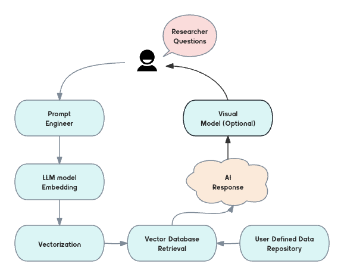
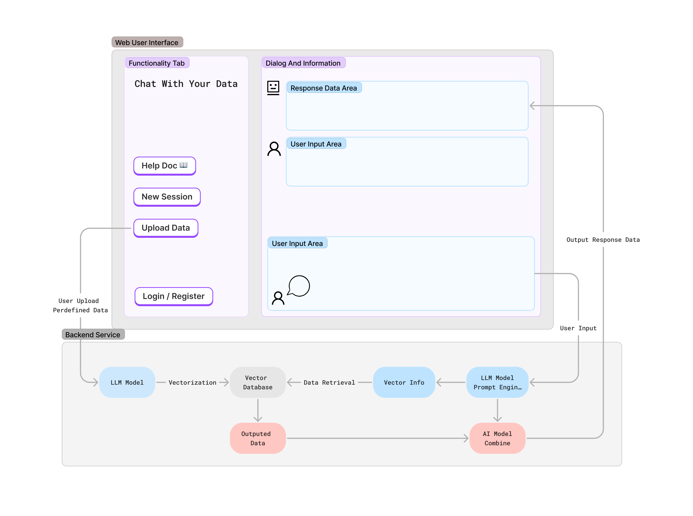

# Project Proposal

**Project Title:** Chat with your Data: LLM and Vector Database

**Author:** Hongye An

**Email:** psxah15@nottingham.ac.uk

## 1. Background Research

In nowadays, information retrieval and literature review have become increasingly challenging tasks. We find ourselves amidst an age where the acquisition of knowledge and the critical analysis of existing literature present formidable challenges. Conventional methods, based on traditional keyword-based search methods may face challenge in this scenery. Opacity, generativity, disparity, and futurity—leading [1] are all the issues in data retrieval in today's data age. And it may often fail to uncover relevant documents when the content is described using varying terminology. 

That is because traditional query techniques often rely on specific keywords or phrases[2]. They may struggle to capture the nuances of language and meaning. When the vocabulary used in queries does not perfectly match the terminology found in the documents, relevant information can be missed, causing a bottleneck in effective retrieval. With the exponential growth of digital content, there is an overwhelming amount of information available. Traditional query techniques may result in an overload of search results, making it time-consuming and challenging for users to sift through large volumes of irrelevant data to find what they need.

## 2. Problem Solutions

Large Language Models (LLMs) have emerged as a promising solution to the above problem. LLMs can convert textual information into a high-dimensional vector space using a method called text embedding, these embeddings represent the semantic and contextual information of the text, allowing the LLM to understand and work with the text data. LLMs (like GPT3) could make the semantically similar documents cluster together, even when they use different words or phrases. 

However, most conversational interfaces for LLMs have a limited prompt size, making them unsuitable for long documents like academic papers. The solution is to build a system that stores documents in vector form within a vector database, which is different from traditional relational databases or some NoSQL databases. A vector database management system (VDBMS) or simply a vector database is a database used for storing high-dimensional vectors, such as word embeddings or image embeddings [3]. Vector databases enable efficient vector queries, aggregation, similarity matching, and other algorithms, which has driven the rapid development of vector data in recent years, especially with the flourishing of LLM technology.

Vector databases can be applied in various ways within the field of Large Language Models (LLMs), which are designed to understand and generate human-like text. LLMs often use pre-trained word or text embeddings to represent words and documents.[4] Vector databases can efficiently store and retrieve these embeddings, making them readily available for various NLP tasks, such as text classification, sentiment analysis, and document retrieval. It could also be used to index large text corpora, enabling semantic search and document retrieval. This is particularly useful for LLMs to quickly find and rank relevant documents based on semantic similarity rather than relying solely on keyword matching.

## 3. Goals and Objectives

This user interface will be a web application that runs in the browser. It should provide users with a conversational-style window on the user interface. For example, users can type "find papers related to paper xxx." At the same time, it should also allow users to upload custom datasets without the need to write or modify any code. For example, a student can upload the university's extenuating circumstances policy and then begin to ask questions such as whether a doctor's appointment is a valid reason for extending a deadline.

Key objectives:

- Research LLM and vector database, and be able to run and deploy them successfully. The deployment location may be local, the school's personal cloud host or a commercial cloud platform, etc.

- Build a stable backend service that provides essential functionalities the users need, such as conversation, custom data upload, and the ability to interact with LLM and vector database services.

- Build a user-friendly front-end interface, which may be a web-based interface and preferably deployed in the cloud.

- Conduct reliability and usability analysis, including user feedback and query accuracy, system response time or other quantifiable indicators.

- Complete a academic paper, which should introduce in detail the background of the project, the specific solutions to the problem, as well as the final effects and evaluation results.

## 4. Project Plan

### 4.1 User Requirements

To gather user requirements for this project, it's essential to engage with real users who would benefit from this project. Understanding their needs and tasks will ensure that the tool is designed to meet their specific requirements. 

The academic researchers and students may be the main user category of the project. They often need to find relevant papers quickly, require a tool that offers rapid access to papers related to their research topics. A system that can understand the context and semantics of their queries, allowing them to discover papers even when the keywords are not an exact match is a better choice.

### 4.2 Prototype Description

#### 4.2.1 Document repository: 
The "Document repository" refers to a digital system or platform designed to serve as a centralized storage and management facility for various types of documents. This repository has the capacity to house a diverse range of content, which might encompass academic papers, university policies related to extenuating circumstances, and the flexibility to allow users to either specify or upload their own custom documents that pertain to a particular field or subject.

This repository serves as a secure and organized space where users can deposit, access, and manage their documents efficiently. It is a digital library that can accommodate documents from different sources, ensuring that users can easily locate, update, or retrieve relevant materials.

#### 4.2.2 Vectorization: 

"Vectorization" refers to the process of converting textual or document-based information into a numerical format, represented as vectors. This transformation allows for efficient and effective processing of the documents and their content. In this particular context, there are two key components related to vectorization:

- **LLM Model**: Using online LLMs API such as chatGPT API or locally (such as [Llama by Meta](https://ai.meta.com/llama/)) to generate vector information of all documents in the repository.

- **Vectorization information storage**:
Leveraging the vector database (such as: [Chroma](https://www.trychroma.com/)) to store the vector information, which enabling efficient retrieval based on semantic similarity.

#### 4.2.3 Backend service
The "Backend service"  pertains to the technical infrastructure that forms the backbone of the entire system. It is responsible for handling user input requests, facilitating interactions with large language models (LLMs) and vector databases, and ensuring the development of highly available backend programs. This service is designed with an emphasis on performance and scalability, enabling it to support the diverse and dynamic requirements of the platform.

The key aspects of the backend service include:

- **User Input Handling**: This component deals with the reception and processing of user requests. It acts as the interface between the user and the system, ensuring that user inputs are properly understood and directed to the appropriate components within the system.

- **LLM Interaction**: The backend service interacts with LLMs, whether through online APIs or local installations. It manages the communication with these language models, enabling document analysis, summarization, and other natural language processing tasks.

- **Vector Database Integration**: This component is responsible for integrating with the vector database to store, retrieve, and utilize vectorized document information. It ensures that the vector representations are efficiently stored and can be accessed when needed.

#### 4.2.4 User Interface
The "User Interface" (UI) component of this project is a web-based interface designed to offer users a user-friendly and intuitive experience when interacting with the document repository and the associated functionalities.

### 4.3 MVP Prototype Figure

  

### 4.4 Final Prototype Figure

  

### 4.5 Evaluation

#### 4.5.1 User Study
Hire test volunteers and use documents related to their areas of interest as data repository input files, Collect user feedback through surveys, interviews, or feedback forms as the main reference of evaluation.

#### 4.5.2 Date Retrieval Performance
Evaluate the efficiency of the vector database. Measure the speed and scalability of document retrieval as the database grows. Use QPS, data size as the main metrics.

#### 4.5.3 Document Retrieval Accuracy
Assess the precision and recall of the system by comparing retrieved documents to a ground truth or user-defined relevant documents. Use precision, recall, error or other metrics to evaluate the accuarcy.

## 5. Timeline Planning

| Item | start | end |
| ---- | ----- | --- | 
| Project confirmation and start | 2023 Oct 14 | 2023 Oct 20 |
| Write project proposal and ethics checklist | 2023 Oct 21 | 2023 Oct 29 |
| Literature review | 2023 Oct 30 | 2023 Nov 12 |
| Background knowledge study - LLM usage | 2023 Nov 13 | 2023 Nov 19 |
| Background knowledge study - Vector Database | 2023 Nov 20 | 2023 Nov 26 |
| Background knowledge study -   Frontend & Backend Development | 2023 Nov 27 | 2023 Dec 3 |
| Start user requirements research and collection | 2023 Dec 4 | 2023 Dec 13 |
| Carry out project implementation design | 2023 Dec 14 | 2023 Dec 24 |
| Start LLM function development and complete   the document vectorization function | 2023 Dec 25 | 2024 Jan 1 |
| Deploy vector database and implement   database query and add/delete interfaces | 2024 Jan 1 | 2024 Jan 10 |
| Prepare for the first semester report | 2024 Jan 11 | 2024 Jan 19 |
| Add report supplementary material - desgin document | 2024 Jan 20 | 2024 Jan 26 |
| Presentation preparation | 2024 Jan 27 | 2024 Feb 7 |
| Formal presentation | 2024 Feb 8 | 2024 Feb 9 |
| Integrate LLM model to the server  | 2024 Feb 22 | 2024 Mar 5 |
| Backend server demo development | 2024 Feb 10 | 2024 Feb 21 |
| Complete first project demo and MVP implementation | 2024 Mar 6 | 2024 Mar 19 |
| Write dissertation & prepare supplementary material | 2024 Mar 20 | 2024 Mar 31 |
| Start research paper writing  | 2024 Apr 1 | 2024 Apr 7 |
| Project functionality testing  | 2024 Apr 8 | 2024 Apr 14 |
| Project user case study | 2024 Apr 15 | 2024 Apr 23 |
| Experimental modifications and optimizations in the project | 2024 Apr 24 | 2024 May 4 |
| Interim paper completed | 2024 May 5 | 2024 May 20 |
| Dissertation writing and supplementary materials | 2024 May 20 | 2024 May 31 |
| Final paper complete and submission | 2024 Jun 1 | 2024 Jun 7 |

## 6. Reference

[1] Ekbia, H., Mattioli, M., Kouper, I., Arave, G., Ghazinejad, A., Bowman, T., Suri, V.R., Tsou, A., Weingart, S. and Sugimoto, C.R., 2015. Big data, bigger dilemmas: A critical review. Journal of the Association for Information Science and Technology, 66(8), pp.1523-1545.

[2] Pound, J., Hudek, A.K., Ilyas, I.F. and Weddell, G., 2012, October. Interpreting keyword queries over web knowledge bases. In Proceedings of the 21st ACM international conference on Information and knowledge management (pp. 305-314).

[3] Vector database (2023) Wikipedia. Available at: https://en.wikipedia.org/wiki/Vector_database (Accessed: 27 October 2023). 

[4] Naseem, U., Razzak, I., Khan, S.K. and Prasad, M., 2021. A comprehensive survey on word representation models: From classical to state-of-the-art word representation language models. Transactions on Asian and Low-Resource Language Information Processing, 20(5), pp.1-35.