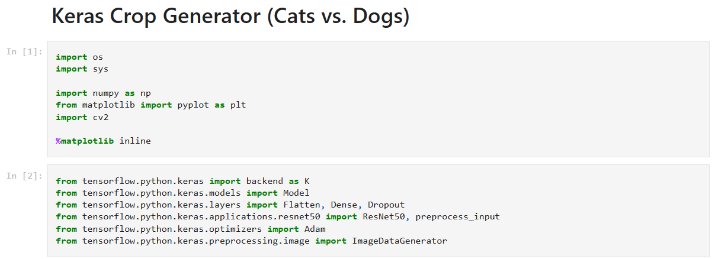
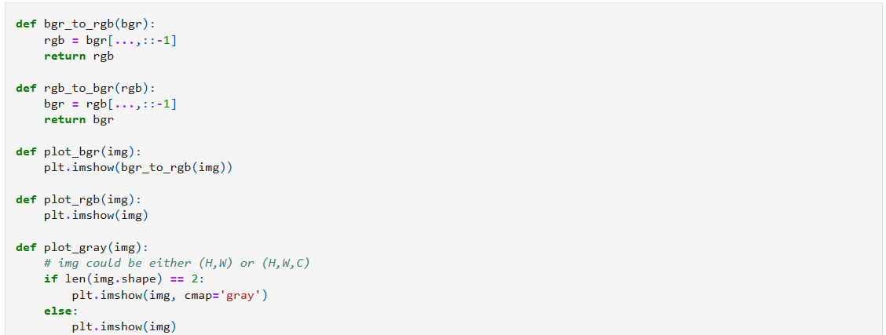
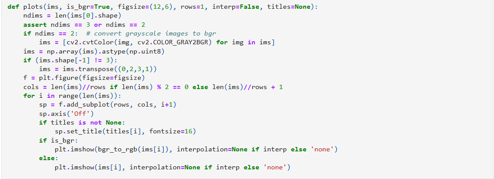
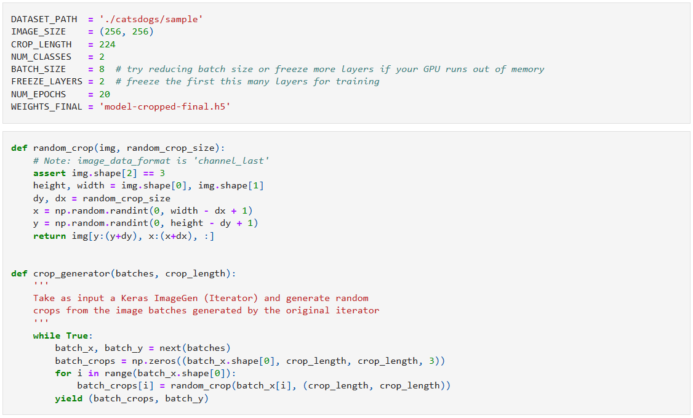
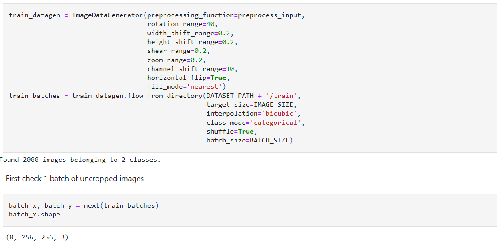
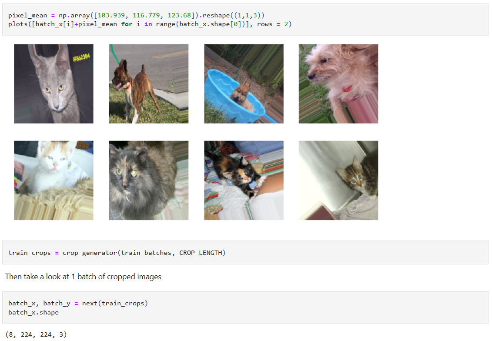
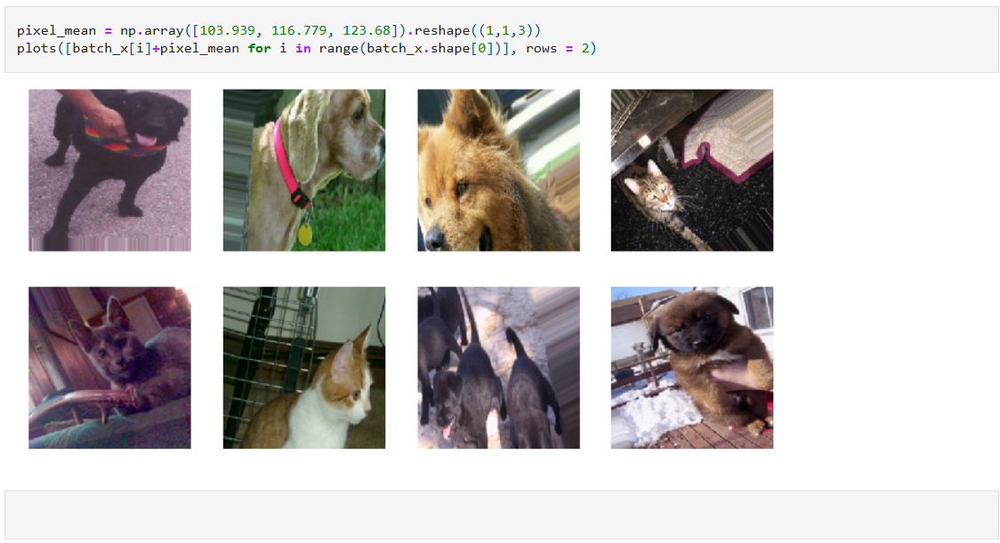

(main idea as visualization of "real time development structure (including cross-cell relations)" in Jupyter)

1. Do you prefer using an editor like PyCharm or Jupyter Notebook for machine learning tasks? What are your reasons for favoring one over the other?

2. What do you find challenging or lacking in Jupyter Notebook for machine learning tasks? Are there additional features you think Jupyter should have?

3. In the process of machine learning, what steps do you typically take for model training and testing (e.g., preparing datasets, feature engineering)? Are there specific steps that you find particularly bothersome?

4. What characteristics of the steps mentioned above make them bothersome for you? What specifically about them is frustrating?

5. Have you tried incorporating Python libraries, such as autoML tools, into notebooks like Jupyter to assist with your machine learning work? If so, do you find them useful?

6. Do you think there are areas for improvement in a specific Python library that you have used for machine learning assistance?

7. When working on machine learning tasks, do you prefer to modify existing code found on platforms or start coding from scratch? What are your reasons for this preference?

8. When looking at machine learning code in Jupyter notebooks written by others or when someone modifies your code, do you find it challenging to understand the new workflow? What specifically makes it difficult to comprehend?

9. If you have experience writing code to solve machine learning tasks, do you regularly record or save data in your notebook or code (e.g., code progress, run results)? If so, what data do you typically save? If not, do you feel troubled by the absence of this data?

10. For the code in the images, what aspects are confusing or require more explanation? If so, what specific information would you like clarification on (e.g., the functionality of imported packages, the purpose of code segments, intercell dependencies, etc.)?

11. If you have experience developing models from scratch, do you wish to generate real-time visualizations representing your progress during model development?

12. In your use of Jupyter for machine learning, what additional assistance or features do you wish Jupyter could provide?

