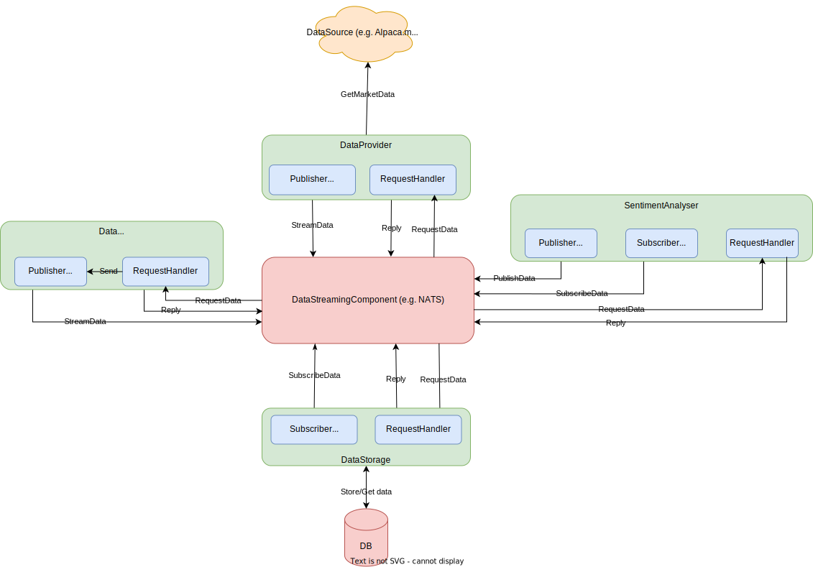

# Data Acquisition Component Design

This document outlines the main design decisions for the data acquisition component, as well as some basic
details about the implementation plan.

## Functionality requirements

To better understand how to build the data acquisition component, an in-depth analysis was done on what data
a typical strategy would need to make trading decisions. Additionally, the eventuality of using market data
and news headlines to train a reinforcement learning model was taken into consideration, especially when it
comes to making data storage design decisions.

### Strategy data requirements

The initial strategies that will be developed will use sentiment analysis and technical analysis to make
trading decisions during the day. More complex trading strategies may be developed later that use market data
and news sentiment to train various types of models.

#### Simple strategy example:

An example of a simple strategy that uses market candle data (window of 5 minutes) for a given symbol and
news headlines with sentiment labels would perform the following operations:

1. Get historical data in the 5 minutes before the strategy started
2. Subscribe to live feed of market data
   * Each new candle data is appended to the dataset of historical data (the overall dataset is in
     chronological order)
3. Given the 5 minute window, make trading decisions every minute based on a strategy

Given the example above we can identify three main types of data:

* Historical market data for a given symbol in a given timeframe
* Live market data for a given symbol
* Live/historical news headlines with sentiment label

#### Strategy with RL model

This is a more complex strategy that uses Reinforcement Learning to train a model that will be used by the
strategy to make decisions.
For this type of strategy, a training step is required for the RL model prior to being able to use it in a
strategy.

**Training step:**

1. Historical data for one or more symbols is used with other technical analysis indicators and news sentiment
   to train the model
2. The strategy uses live and historical data (based on model requirements) that is fed into the model to
   generate trading signals.

---

One important factor to keep in mind is that in some cases multiple distinct strategies or multiple variations
of the same strategies might be running at the same time and require the same exact data. In those cases it
would be ideal to get the data from a local storage instead of requesting it fresh from the data source.

### Requirements

Given the scenarios described above, the following requirements can be extracted for the data acquisition
component of the platform:

* The data acquisition system should
  * Be able to provide, on request, one or multiple streams for multiple symbols from a data source
    (e.g. alpaca.markets)
  * Be able to provide, on request, historical data for one or multiple symbols
  * Be able to provide, on request, live and historical news for one or multiple symbols
  * Be able to provide, on request, sentiment labels for articles from one or multiple LLMs
  * Be able to store historical/live news/market data
    * This is required
      * For model training purposes
      * As a cache for historical market data and news with sentiment labels (to avoid running the LLMs on the
        same article multiple times if multiple strategies need it)
      * To perform analysis on the data used to make a specific trading decision and adapt the strategy

## System design

Given the requirements described in the [requirements](#requirements) section, the following design diagram
was created:

**Note:**

* Red components are pieces of software that already exist and are being adopted
* Green components need to be implemented

In the diagram the following components can be identified:

* DataSouce
* DataProvider
* DataInterface
* SentimentAnalyser
* DataStorage
* DB (database)
* DataStreamingComponent

### DataSource

In the diagram, the DataSource represents the source or sources from where market data and news data is
provided.

This is an external service (e.g. Alpaca.markets)

### Database

Main component where data is stored and retrieved from. It needs to allow fast data retrieval.

### DataStreamingComponent

Intermediary component that is used as a communication channel between all other components. It needs to
support two distributed system paradigms:

* Publisher/subscriber
  * Used for live data distribution
* Request/reply
  * Used to request historical data

### DataProvider

The DataProvider component is responsible of subscribing to live market/news data streams and publishing it
to the DataStreamingComponent. If a single stream of data is provided by DataSource for multiple symbols, the
DataProvider needs to split it and generate a separate stream for each symbol.

Additionally, the DataProvider should accept market data/news request for a given symbol and timeframe, query
the DataSource upstream and then send a reply to the requester with the data.

Each piece of data that passes through the DataProvider is identified with a unique ID obtained from hashing
the data. Using this approach allows for each datapoint that passes through the system to be uniquely
identified and associated with a particular trading decision that a strategy may make.

When the DataProvider is started, it starts listening for historical data requests and for commands.

**The following commands need to be supported:**

* Stream start for one or multiple symbols
* Stream stop
* Stream symbols change

**DataProvider requires the following sub-components:**

* PublisherStreamHandler
  * Responsible of publishing one or multiple streams to the DataStreamingComponent
* RequestHandler
  * Responsible of handling historical data requests
  * Responsible of handling DataProvider commands

### DataStorage

The DataStorage component is responsible of subscribing to all data streams and storing the data in
appropriate tables.

Additionally, it is responsible of handling data requests, forwarding them to the database, and sending
requested data as a reply to the requester.

When the DataStorage component is started, it starts to listen for data and command requests.

**The following commands need to be supported:**

* Stream subscribe to store
* Stream subscribe stop

**DataStorage requires the following sub-components:**

* SubscriberStreamHandler
  * Responsible of subscribing to one or multiple streams and sending data to
    the database
* RequestHandler
  * Responsible of handling data requests
  * Responsible of handling DataStorage commands

### DataInterface

The DataInterface component is the main interface used by strategies to get data. The interface's main
responsibility is figuring out where to get the data from (e.g. DataSource or DataStorage) and forwarding the
complete data to the strategies as a reply.

It also handles requests for data streams. The DataInterface receives a request for a specific data stream to
be enabled, it requests the DataProvider to start streaming requested data, and it replies to the requester
with the name of the stream it should subscribe to in order to get the data.

Additionally, if it cannot obtain data from the DataStorage, and instead it gets it from the DataProvider, it
will stream the newly acquired data to the DataStorage component for it to be saved in the database.

**The following commands need to be supported:**

* Stream get
  * Requests DataProvider to start streaming data for a given symbol

**DataInterface requires the following sub-components:**

* PublisherStreamHandler
  * Responsible of publishing newly acquired data to be stored
* RequestHandler
  * Responsible of handling data requests
  * Responsible of handling stream get commands

### SentimentAnalyser

The SentimentAnalyser component is responsible of interracting with one or multiple LLMs and providing
sentiment labels for article streams that it either subscribes to or that it receives sentiment analysis
requests for.

When the SentimentAnalyser starts, it will start listening for analysis requests or for stream subscription
commands.

**The following commands need to be supported:**

* Stream analyze
  * Will start listening to a news stream and stream the news back with the sentiment label included
* Stream stop

**SentimentAnalyser requires the following sub-components:**

* SubscriberStreamHandler
  * Responsible of subscribing to news articles streams and performing sentiment analysis
* PublisherStreamHandler
  * Responsible of re-publishing news articles with sentiment label
* RequestHandler
  * Responsible of handling news sentiment requests
  * Responsible of handling stream analyze commands

## Initial implementation details

To implement the system described above, specific implementation decisions were made.

### DataSource and account management

The main data source that will be used for this project is Alpaca.markets which provides both live and
historical market data/news for stocks and crypto.

### DataStreamingComponent

For the DataStreamingComponent, NATS will be adopted since it provides reliable communication channels with
both publisher/subscriber and request/reply paradigms.

To facilitate and ensure reproducible deployment, a containerized version of the NATS server will be used with
Docker.

### Database and DataStorage component

The chosen database for this system is ClickHouse mainly due to its columnar storage architecture which
provides great reading speeds, especially for the timestamped type of that we will be working with.

The DataStorage component will interact with the database using an ORM (object-relational mapping) library
which makes inserting new data and getting data much easier.

### Implementation language and containerization

Each of the components that need to be developed (e.g. DataProvider, DataInterface...) will be implemented
using Golang. There are two main reasons for choosing this language over others such as Python.

The first one is its good parallelism capabilities through Goroutines (Python parallelism is always tricky),
which is a big requirement given that every component has an asynchronous stream/request management component.
And the second is it being strongly typed, which makes the overall system less error-prone and less
susceptible to type related bugs.

Additionally, each component will be integrated in a Docker container. When the container starts, the
component automatically starts listening for commands and requests. Each component will produce logs to ensure
that any issues can be monitored and if any bug is found it can be easily fixed.