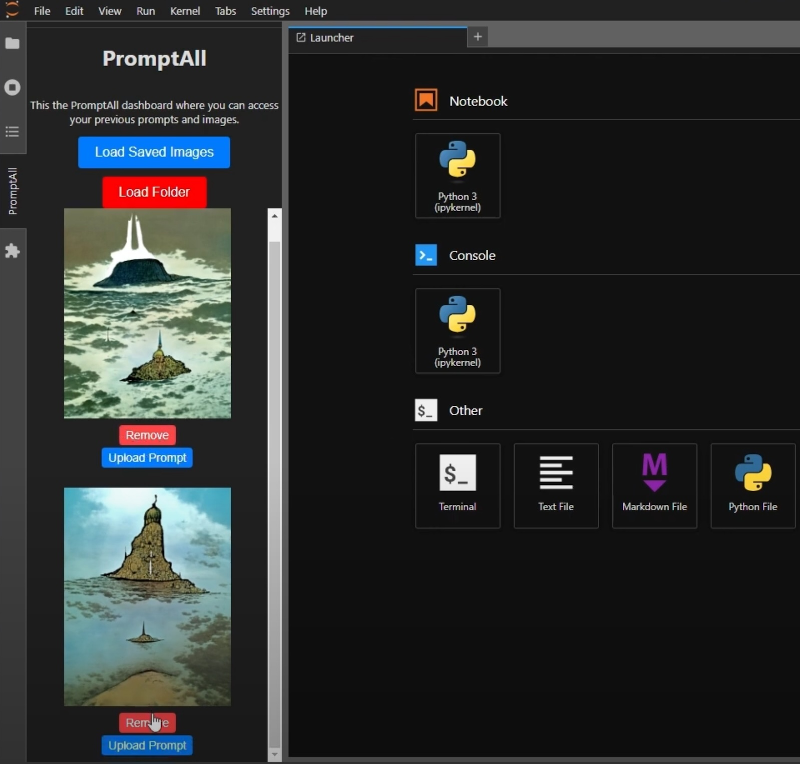

# PromptAll 
# JupyterLab PromptAll Extension Documentation

## Overview

The JupyterLab PromptAll extension is a plugin for [JupyterLab](https://jupyterlab.readthedocs.io/en/stable/) that pairs up a text prompt and images generated in a JupyterLab panel. This extension allows users to load and display text prompts and associated images conveniently within a JupyterLab environment.

The following will show how the extension works and provide guidance on how to extend it for further development.
Additionally, there is a [video](https://youtu.be/u5iPw-sPjE4) available for guidance: 

[](https://youtu.be/u5iPw-sPjE4)

## Getting Started

### Development Environment & Installation

To use the JupyterLab PromptAll extension, you need to install it first. Follow these steps:

1. Make sure you have conda installed. If not, you can install it using [miniconda](https://docs.conda.io/projects/conda/en/latest/user-guide/install/index.html)

2. Open a terminal or command prompt.

3. Make sure you have JupyterLab installed and NodeJS. If not, you can install it using the following command which will also create a new environment called "PromptAll":

   ```
   conda create -n PromptAll --override-channels --strict-channel-priority -c conda-forge -c nodefaults jupyterlab=4 nodejs=18 git copier=7 jinja2-time
   ```
4. Activate the environment:

   ```
   conda activate PromptAll
   ```
   
5. Install the build dependencies:

   ```
   pip install -e .
   jupyter labextension install .

   ```
6. Start JupyterLab:

   ```
   jupyter lab
   ```

### Activation

After installing the extension and starting JupyterLab, open the View Panel -> Activate Command Palette and type "PromptAll". It will then open up on the side panel where you can access the interface.

## How It Works

The JupyterLab PromptAll extension adds a new panel to JupyterLab called "PromptAll." This panel allows users to access and manage previous prompts and their associated images by either uploading a whole folder with the images and settings that follow a specific naming convention or by uploading an individual image and setting for the ones that do not follow this convention.

### Accessing the PromptAll Panel

To begin using the JupyterLab PromptAll extension, follow these steps:

- **Launch JupyterLab:** Navigate to JupyterLab.

- **Access the PromptAll Panel:** To access the PromptAll panel, use the Command Palette: You can also open the command palette by pressing Ctrl + Shift + C (or Cmd + Shift + C on macOS). Then, type "PromptAll" and select the "PromptAll: Open" option.


- **The PromptAll Panel:** Once you've accessed the PromptAll panel, it will appear within the JupyterLab interface.


### Loading Prompts and Images

The PromptAll panel provides two options for loading prompts and images:

Load Saved Images
- **Click the "Load Saved Images" Button:** This button allows you to load images that you've previously saved on your local system.

- **File Dialog:** When you click the button, a file dialog will appear, enabling you to select one or more image files. These images can be in various formats, such as JPEG, PNG, or others.

- **Display:** The selected images will be displayed within the PromptAll panel, making them accessible for viewing and management.

Load Folder
- **Click the "Load Folder" Button:** This button provides a way to load a folder that contains prompt files and their associated images.

- **Folder Selection Dialog:** After clicking the button, a folder selection dialog will open. Choose a folder that contains your prompt files and images.

- **Organized Display:** The extension will automatically organize and display the prompts and images from the selected folder within the PromptAll panel. This makes it easy to navigate and manage your content.

  

### Managing Prompts and Images
Once you've loaded prompts and images into the PromptAll panel, you can perform various actions to manage your content:

- **View Previously Saved Prompts and Images:** The panel displays a list of your saved prompts and their associated images, making it easy to review and access them.

- **Upload Text Prompts:** Each image displayed in the panel includes an "Upload Prompt" button. By clicking this button, you can associate a text prompt with the corresponding image. This allows you to keep track of text prompts that are related to specific images.

  

- **Remove Images and Prompts:** For each image, there is a "Remove" button. Clicking this button allows you to remove the image and its associated text prompt from the panel. This feature helps you manage your content and keep the panel organized.

## Extending the Extension

Developers can extend the JupyterLab PromptAll extension to add new features or customize existing functionality. Below are some guidelines on how to extend the extension:

### Adding New Features

To add new features to the extension, you can:

- Add a function that allows the user to display an image from a notebook by communicating with the kernel.

- Extend the context menu functionality to perform custom actions on images or prompts.

- Modify the appearance and layout of the PromptAll panel to accommodate additional content or controls.

- Enhance the prompt loading process to support different file formats or sources.

### Modifying the User Interface

To modify the user interface of the PromptAll panel, you can:

- Update the HTML structure and styles in the `createSidebarContent` function to change the layout and appearance of the panel.

- Customize the appearance of buttons, containers, and text elements to match your design requirements.

### Handling New File Formats

To support additional file formats or convert text prompts from different sources, you can:

- Modify the `convertWordToText` function to handle different file formats or text extraction methods.

- Extend the `createTextContainer` function to display content in the desired format.

### Adding Context Menu Actions

To add custom context menu actions for images or prompts, you can:

- Extend the context menu configuration in the `activate` function. Update the `app.contextMenu.addItem` method to define new commands and selectors.

- Create new command functions to handle the actions associated with the context menu items.

## Requirements

- JupyterLab >= 4.0.0
- @jupyterlab/apputils
- @jupyterlab/filebrowser
- @lumino/widgets
- mammoth

## Contributing
### Development install

Notes: 
- You will need NodeJS to build the extension package.
- All development code is written under the index.ts file under ./scr
- The Mammoth JS library is used to convert the .docx text_prompts into plain text that can be displayed on the extension panel

The `jlpm` command is JupyterLab's pinned version of
[yarn](https://yarnpkg.com/) that is installed with JupyterLab.

```bash
# Clone the repo to your local environment
# Change directory to the PromptAll directory
# Install package in development mode
pip install -e "."
# Link your development version of the extension with JupyterLab
jupyter labextension develop . --overwrite
# Rebuild extension Typescript source after making changes
jlpm build
```

You can watch the source directory and run JupyterLab at the same time in different terminals to watch for changes in the extension's source and automatically rebuild the extension.

```bash
# Watch the source directory in one terminal, automatically rebuilding when needed
jlpm run watch
# Run JupyterLab in another terminal
jupyter lab
```

With the watch command running, every saved change will immediately be built locally and available in your running JupyterLab. Refresh JupyterLab to load the change in your browser (you may need to wait several seconds for the extension to be rebuilt).

You may need to enable [Developer Mode](https://learn.microsoft.com/en-us/windows/apps/get-started/enable-your-device-for-development) when using Windows.

By default, the `jlpm build` command generates the source maps for this extension to make it easier to debug using the browser dev tools. 

