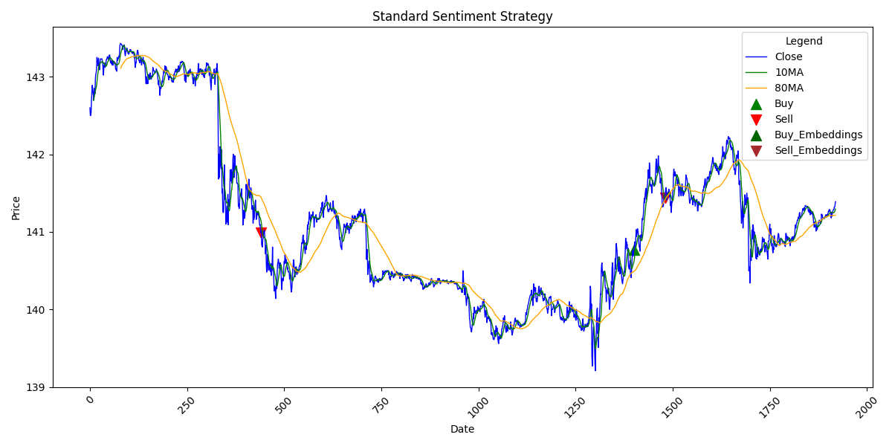
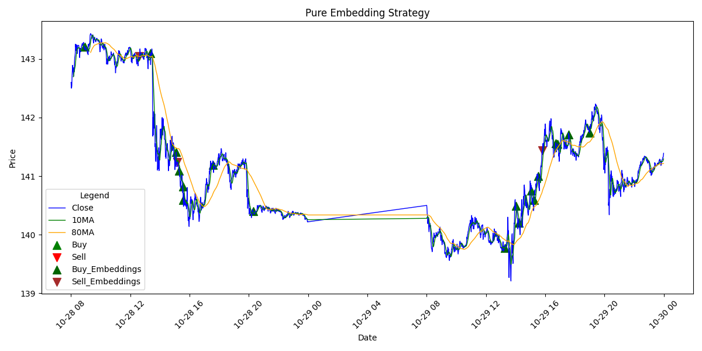

# Results From Experimentation

Results from any output of the models created. This includes signal generation methods and results from backtests.

## Current Table of Results
| Timestamp           | File Name                     | Initial Portfolio Value | Final Portfolio Value    | Total PnL                  | Annualized Return      | Annualized Volatility | Sharpe Ratio           |
|---------------------|-------------------------------|--------------------------|--------------------------|----------------------------|------------------------|-----------------------|------------------------|
| 2024-11-26 12:19:44 | signals_standard_strat.csv    | 50000.0                 | 50560.0                 | 1.12                      | 0.1451                | 0.0889               | 1.6324                |
| 2024-11-26 12:19:44 | signals_pure_embedding_strat.csv | 50000.0                 | 51289.2                | 2.5784                    | 0.3631                | 0.1740               | 2.0871                |
| 2024-11-26 12:19:44 | signals_embedding_strat.csv   | 50000.0                 | -231984.0              | -563.968                  |                        | 78.5368              |                        |
| 2024-11-27 10:20:06 | signals_standard_strat.csv    | 50000.0                 | 55600.0                | 11.2                      | 2.6387                | 0.8890               | 2.9682                |
| 2024-11-27 10:20:06 | signals_pure_embedding_strat.csv | 50000.0                 | 62892.0                | 25.784                    | 15.2971               | 1.5546               | 9.8402                |
| 2024-11-27 10:20:06 | signals_embedding_strat.csv   | 50000.0                 | -231984.0              | -563.968                  |                        | 78.5368              |                        |
| 2024-11-28 17:48:20 | signals_standard_strat.csv    | 50000.0                 | 55600.0                | 11.2                      | 2.6387                | 0.8890               | 2.9682                |
| 2024-11-28 17:48:20 | signals_pure_embedding_strat.csv | 50000.0                 | 62892.0                | 25.784                    | 15.2971               | 1.5546               | 9.8402                |
| 2024-11-28 17:48:20 | signals_embedding_strat.csv   | 50000.0                 | -231984.0              | -563.968                  |                        | 78.5368              |                        |
| 2024-11-28 17:51:41 | signals_standard_strat.csv    | 50000.0                 | 55600.0                | 11.2                      | 2.6387                | 0.8890               | 2.9682                |
| 2024-11-28 17:51:41 | signals_pure_embedding_strat.csv | 50000.0                 | 62892.0                | 25.784                    | 15.2971               | 1.5546               | 9.8402                |
| 2024-11-28 17:51:41 | signals_embedding_strat.csv   | 50000.0                 | 49236.2                | -1.5276                   | -0.8463               | 0.3754               | -2.2542               |
| 2024-11-28 17:55:35 | signals_standard_strat.csv    | 50000.0                 | 55600.0                | 11.2                      | 2.6387                | 0.8890               | 2.9682                |
| 2024-11-28 17:55:35 | signals_pure_embedding_strat.csv | 50000.0                 | 62892.0                | 25.784                    | 15.2971               | 1.5546               | 9.8402                |
| 2024-11-28 17:55:36 | signals_embedding_strat.csv   | 50000.0                 | 64438.0                | 28.876                    | 20.8991               | 1.7452               | 11.9750               |

## Plots of generated signals and moving averages

### Embedding Cosine Similarity Strategy

### Counting Sentiment Strategy

### LLM Embedding Strategy

